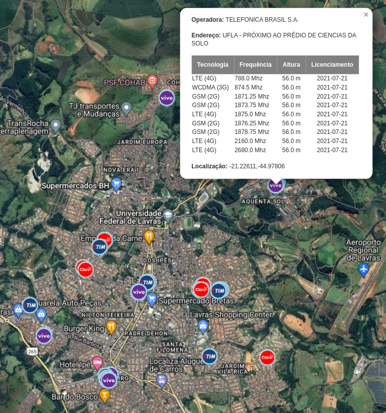

## Mapa de sinais de operadoras de celular
Mapa interativo que mostra informações de transmissão de sinais de redes de celular

[Ver mapa online (CLIQUE AQUI)](https://wesleyabreu.github.io/mapa-sinais-operadoras)

Ele vem carregado com o processamento de dados de planilhas baixadas no site da ANATEL com infomações sobre licenciamento de radiofrequência das cidades de Perdões, Cana Verde, Lavras, Ribeirão Vermelho e Nepomuceno, todas cidades localizadas em Minas Gerais, o objetivo principal desse projeto é consultar disponibilidade de internet movél para zona rural dessa região.

Porém qualquer um pode modificar e colocar a cidade que queira fazer a ilustração das torres obtendo no site https://sistemas.anatel.gov.br/se/public/view/b/licenciamento.php?view=licenciamento
o download do arquivo CSV filtrando sua localidade e colocando no código e executando o programa que gerara um arquivo HTML para abrir no navegador

## Bibliotecas do Python usadas
- Pandas (Leitura e manipulação de arquivos CSV)
- Folium (Implementação do mapa)

Ao executar o processador.py ele demora um tempinho e aparece alguns warning, mas tudo bem só aguardar e depois abrir o HTML gerado.